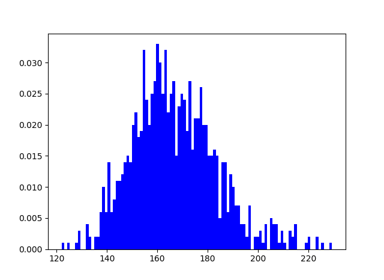
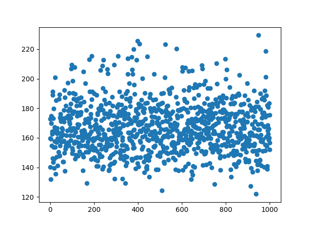
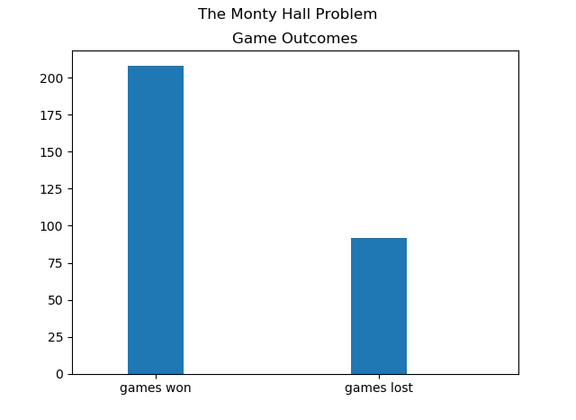
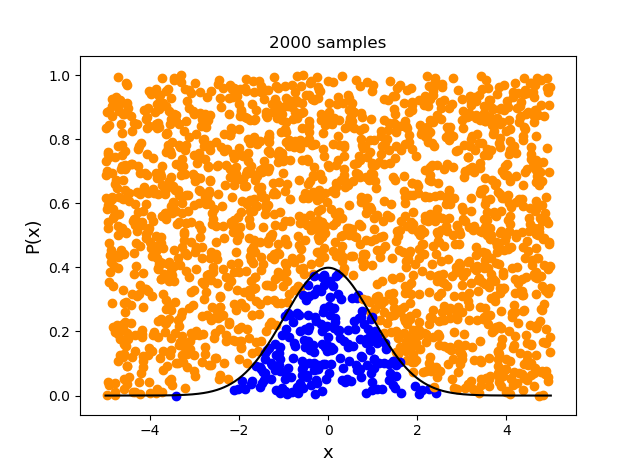
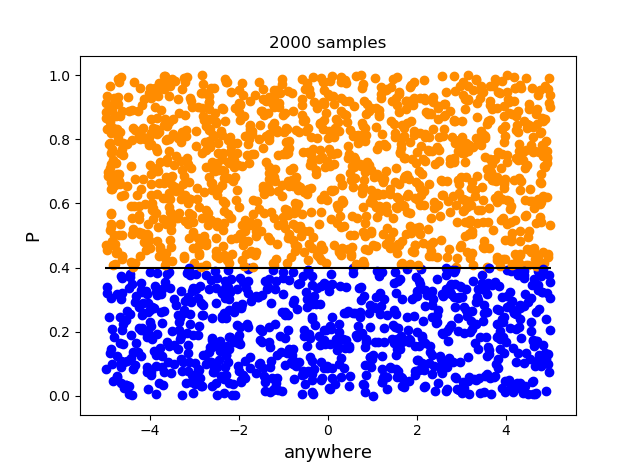
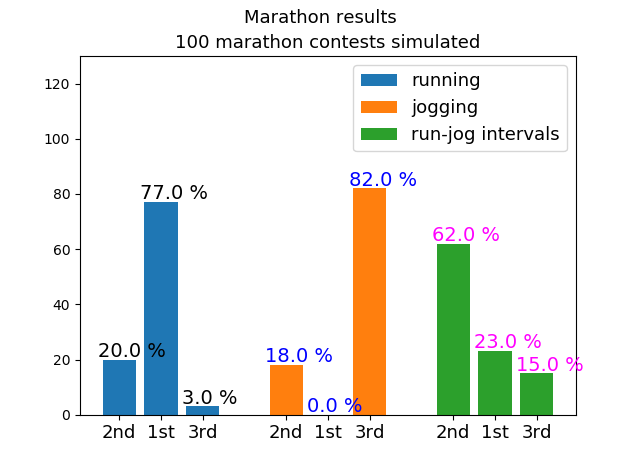

# Basics of Monte Carlo algorithm explained through examples
## Author: Andrew Garcia

Copyright 2019 Andrew Garcia

Licensed under the Apache License, Version 2.0 (the "License");
you may not use this file except in compliance with the License.
You may obtain a copy of the License at

    http://www.apache.org/licenses/LICENSE-2.0

Unless required by applicable law or agreed to in writing, software
distributed under the License is distributed on an "AS IS" BASIS,
WITHOUT WARRANTIES OR CONDITIONS OF ANY KIND, either express or implied.
See the License for the specific language governing permissions and
limitations under the License.

## mc_simple.py
Simple Monte Carlo **mc_simple.py**: Sample inputs from their corresponding random distributions to generate output distribution.

## monte_hall.py
Simulating Monte Hall problem through conditional selection (Monte Carlo algorithm)

## montemarathon.py
The rejection sampling criterion:

U = [random number from uniform distribution (0,1)]

if P(x) > U

  accept x (label with blue)

else

  reject x (label with orange)

can be understood to be based on the premise that sampling "U" values above those of a probability distribution of a certain event do not constitute a part of said event and are thus rejected.

In a similar way, for rejection sampling based on a single value:

[accept x if P > U else reject x]

Event cannot pass with a higher probability than determined. Colloquially speaking, it is highly unlikely for you to flip an unbiased coin and get heads the first 99 flips and tails on the 100th.

Example of rejection sampling MC based on uniformly dist. probabilities; Marathon Race Outcomes under different strategies (run-jog-run/jog)

